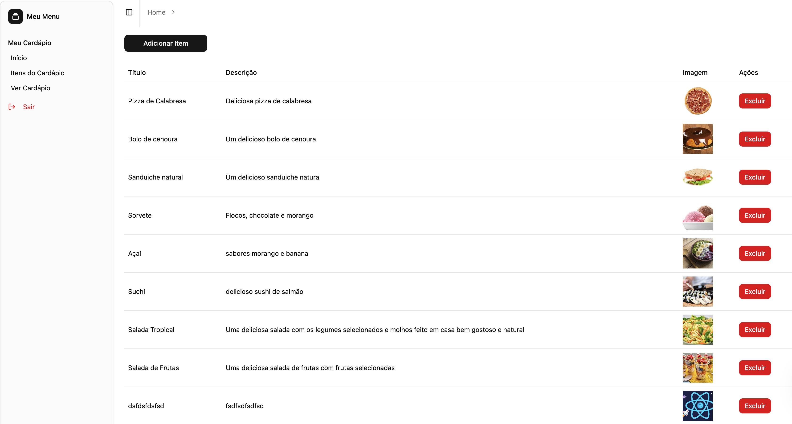

# 🍽️ Cardápio Digital - Frontend

Frontend do sistema de cardápio digital, desenvolvido com **React**, **TypeScript**, **Vite**, **TailwindCSS**, **Shadcn UI**, **Autenticação com JWT** e estruturado com o padrão arquitetural **MVVM (Model-View-ViewModel)**.

---




## 🧱 Tecnologias Utilizadas

- [React](https://reactjs.org/)
- [TypeScript](https://www.typescriptlang.org/)
- [Vite](https://vitejs.dev/)
- [Tailwind CSS](https://tailwindcss.com/)
- [Shadcn UI](https://ui.shadcn.com/)
- [Zod](https://zod.dev/) (validação de dados)
- [Axios](https://axios-http.com/) (requisições HTTP)
- [React Router](https://reactrouter.com/) (rotas da aplicação)

---

## 🎯 Arquitetura (MVVM)

```bash
src/
├── models/         # Tipagens e estruturas de dados
├── viewmodels/     # Lógica de negócio e comunicação com serviços
├── views/          # Componentes de UI (pages e components)
├── services/       # Requisições à API
├── routes/         # Rotas da aplicação
├── lib/            # Utilitários, helpers e configurações
└── main.tsx        # Ponto de entrada da aplicação
```
📌 Funcionalidades:
	•	Autenticação com JWT
	•	Painel administrativo (CRUD de pratos)
	•	Storefront listando e buscando pratos
	•	Busca com debounce para melhoria da performance

🚀 Como rodar o projeto

1. Clone o repositório:
git clone https://github.com/christian-de-ornellas/menuio-frontend.git
cd menuio-frontend

2. Instale as dependências:

```bash
npm install
# ou
yarn
```

3. Configure as variáveis de ambiente:

```bash
// Crie um arquivo .env com essas info abaixo:

VITE_API_URL=http://localhost:8080/api/v1
VITE_PUBLIC=http://localhost:8080
```

4. Você precisar clonar e rodar o repositório:
```bash
git clone https://github.com/christian-de-ornellas/menuio-backend.git
cd menuio-backend
yarn && yarn dev 
ou 
npm install && npm run dev
```
5. Depois de rodar o backend é só rodar o frontend
```bash

yarn && yarn dev 
ou 
npm install && npm run dev
```

# Licensa
Distribuído sob a licença MIT. Veja LICENSE para mais informações.

Feito com ❤️ por Christian Possidonio